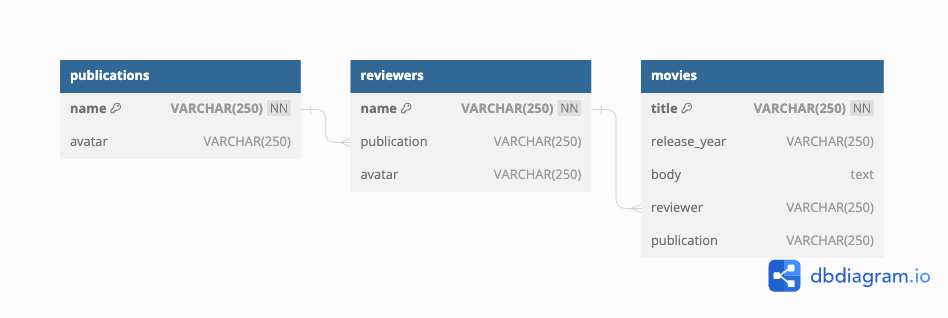

# movie-analyst-api
API for the movie analyst application 

## Deploy mysql database
In order to deploy this application you will need to deploy a , and build the following schema:

Bear in mind that you would need to pass the connection data to the application for it to work, check the code, the environment variables are there :D

**Note**

Run the following command to fill the database

        node seed.js

## Steps to run this application

1. Install node version v12.22.12 and npm version 6.14.16.
2. run npm install
   
        npm install

4. run node server.js

        node server.js

## Attributions
Application developed based on this post https://scotch.io/tutorials/building-and-securing-a-modern-backend-api
